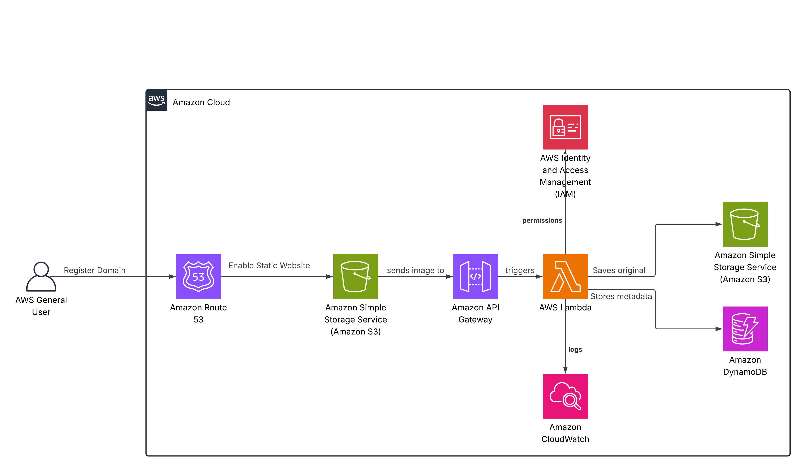

# Manara_Project
# Serverless Image Processing with S3 and Lambda

## Project Description

This project implements a fully serverless image upload and metadata management application using AWS. Users can upload images via an HTTP API, which triggers a Lambda function that stores the image in an S3 bucket and records metadata (like file name, type, and upload time) in DynamoDB. This showcases a real-world event-driven architecture using AWS services.

---

##  AWS Services Used
| Service               | Purpose                                                              |
|------------------------|----------------------------------------------------------------------|
| **Amazon Route 53**     | Manages the custom domain for the API                               |
| **Amazon API Gateway**  | Provides the public REST API endpoint to trigger the workflow       |
| **AWS Lambda**          | Executes logic for validation, processing, uploading, and saving data|
| **Amazon S3**           | Stores original and processed image files                           |
| **Amazon DynamoDB**     | Stores image metadata (filename, size, upload date)                 |
| **Amazon CloudWatch**   | Logs function execution and monitors performance                    |
| **IAM Roles**           | Manages secure access between AWS services                          |

---

##  Architecture Overview
1. The user accesses the service via `https://upload.mennaimages.com`.
2. API Gateway receives the image upload request and triggers a Lambda Function.
3. Lambda:
   - Stores the image in an S3 bucket.
   - Saves metadata in DynamoDB.
   - Logs execution via CloudWatch.
4. CloudWatch monitors and logs all Lambda executions.

---

